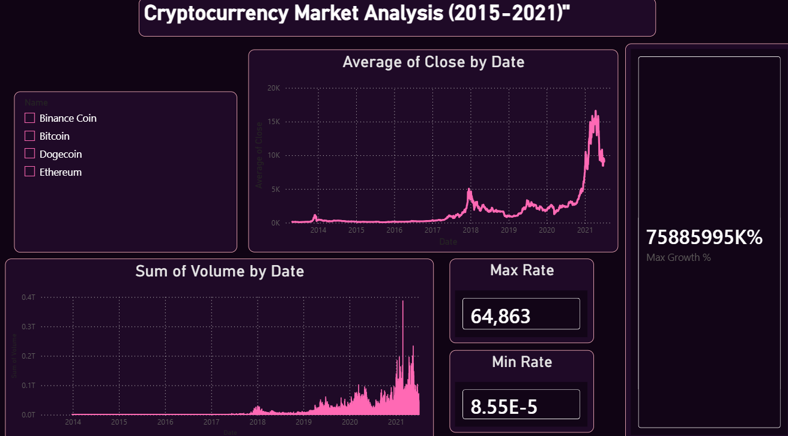
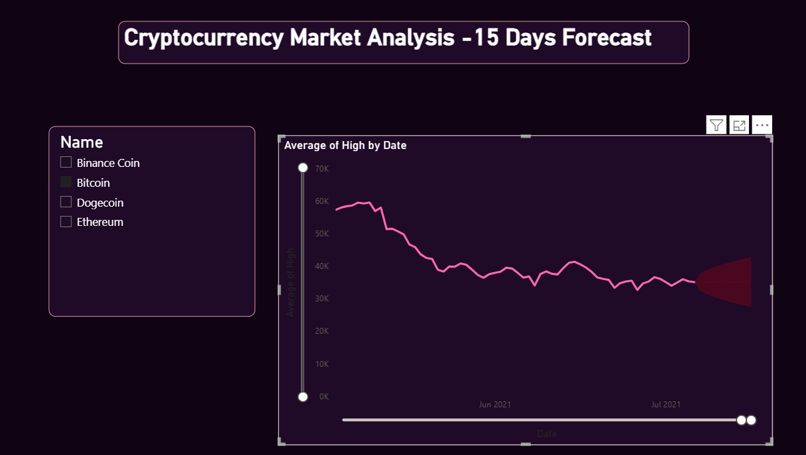
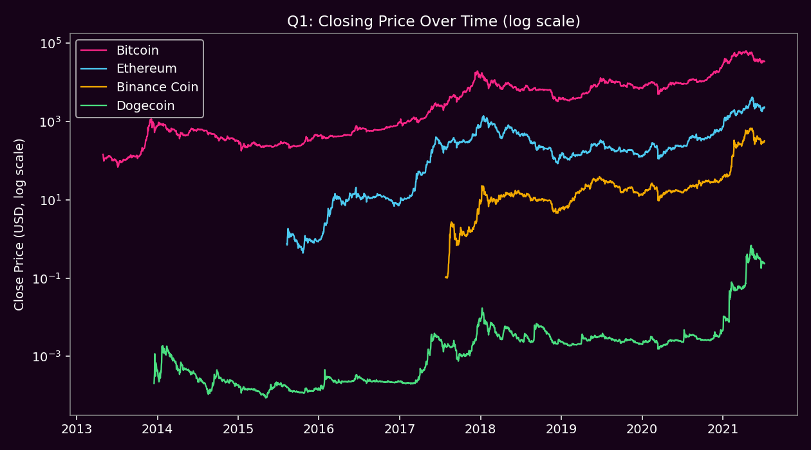
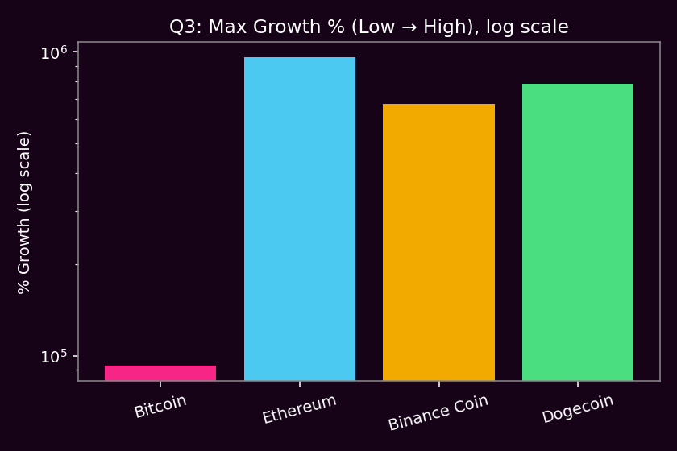
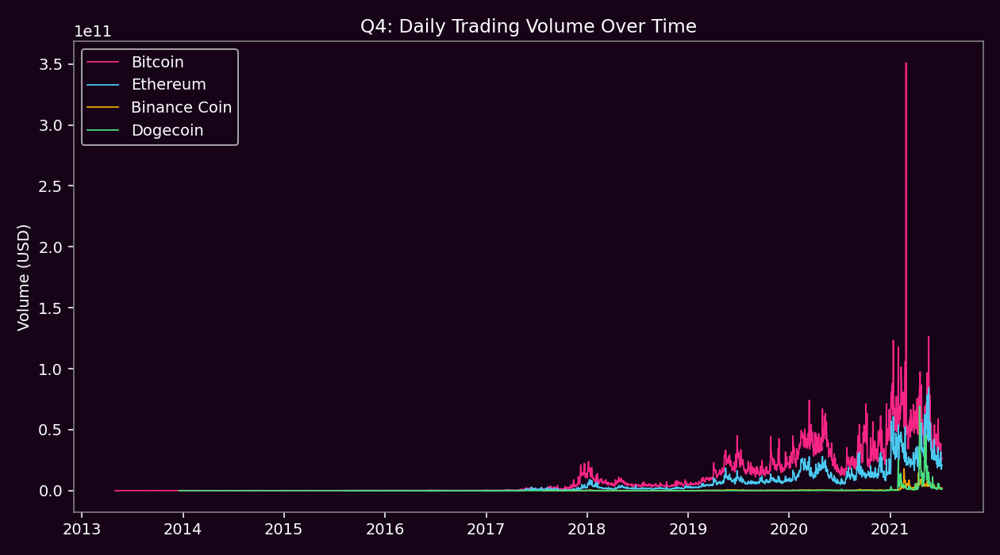
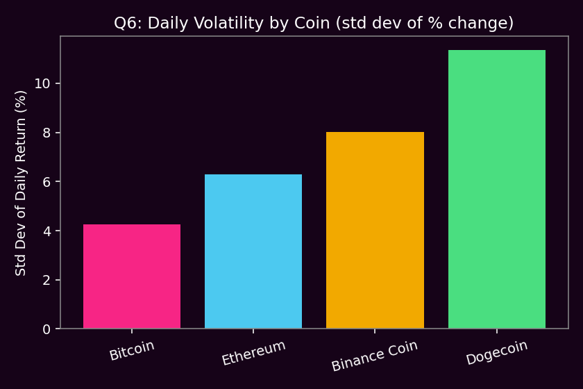
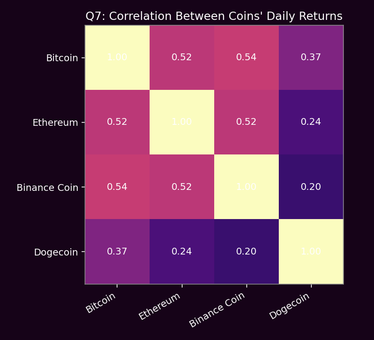
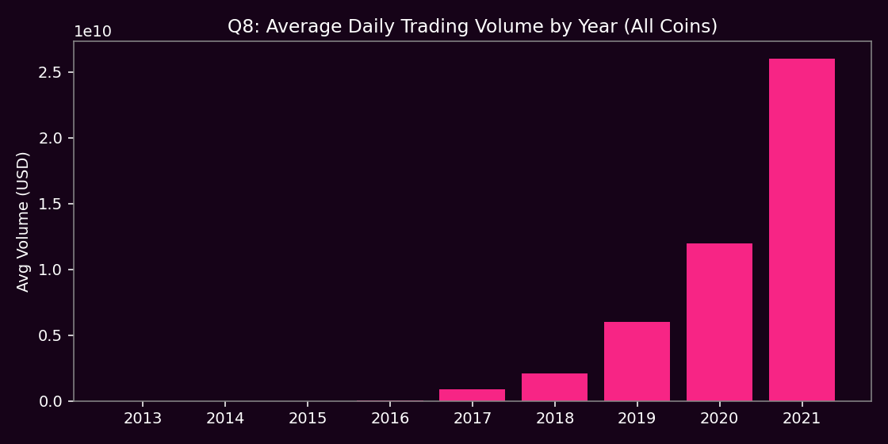
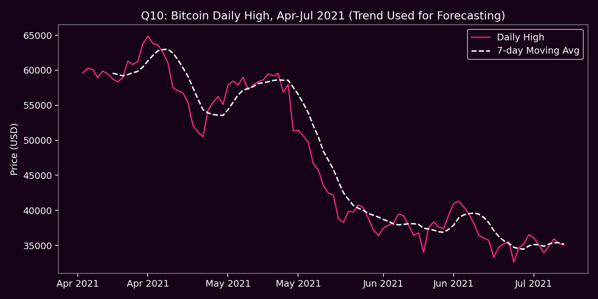

# 💰 Cryptocurrency Market Analysis (2015–2021)

A market-analytics project covering four major coins — **Bitcoin, Ethereum, Binance Coin, and Dogecoin** — from their earliest recorded trading day through mid-2021. Python EDA answers ten market-behavior questions; a Power BI dashboard turns the same data into a live market monitor with a short-term forecast.




---

## 📖 The Story

Crypto is famous for two things: insane growth stories and stomach-dropping crashes. This project asks a simple question — *if you'd tracked Bitcoin, Ethereum, Binance Coin, and Dogecoin from the day each one started trading, what would the data actually tell you?*

The answer turns out to be more nuanced than "number go up." Bitcoin is the least volatile of the four but had the smallest percentage growth from its low. Dogecoin — a coin that started as a joke — had the single best trading day of any coin in the dataset (+355% in one day) and is also the most volatile. The four coins move together during market-wide panics (like the March 2020 COVID crash, where all four fell 37–44% in a single day) but the correlation is far from perfect the rest of the time.

The Python layer digs into growth, volatility, volume, and correlation across the four coins. The Power BI layer turns that into a live dashboard: total market trend, per-coin filtering, max/min rate cards, a max-growth headline stat, and a short-term forecast cone built from the trend.

---

## 🗂️ Dataset

**Source:** Historical daily OHLCV (Open/High/Low/Close/Volume) data for major cryptocurrencies, commonly distributed as the "Cryptocurrency Historical Prices" dataset on Kaggle.

| Coin | Symbol | Data Starts | Rows |
|---|---|---|---|
| Bitcoin | BTC | 2013-04-29 | 2,991 |
| Ethereum | ETH | 2015-08-08 | 2,160 |
| Binance Coin | BNB | 2017-07-26 | 1,442 |
| Dogecoin | DOGE | 2013-12-16 | 2,760 |

**Columns:** `Date`, `High`, `Low`, `Open`, `Close`, `Volume`, `Marketcap`

---

## ❓ Questions I Asked — and Answered

### Q1. How did each coin's price evolve over its full history?
All four show the same shape — long flat stretches punctuated by sharp spikes (late 2017 and early 2021) — but at wildly different price scales, so the chart uses a log axis to compare them fairly.


### Q2. What are the all-time Max and Min prices? (dashboard's Max Rate / Min Rate cards)
| Coin | Min Close | Max Close |
|---|---|---|
| Bitcoin | $68.43 | $63,503.46 |
| Ethereum | $0.43 | $4,168.70 |
| Binance Coin | $0.10 | $675.68 |
| Dogecoin | $0.000087 | $0.68 |

### Q3. What's the max % growth from low to high? (dashboard's "75,885,995K% Max Growth")
Because Dogecoin and Binance Coin started at fractions of a cent, their percentage growth numbers are astronomical: **Ethereum +958,599%**, **Dogecoin +784,608%**, **Binance Coin +676,485%**, vs **Bitcoin +92,699%**. This is exactly why the dashboard's headline growth stat looks like an absurd number — it's mathematically correct but scale-sensitive, a classic "% growth from near-zero" trap.


### Q4. How did trading volume evolve, and who dominates it?
Bitcoin has moved **~$32.6 trillion** in cumulative volume, more than double Ethereum's ~$15.2 trillion, with Dogecoin and Binance Coin far behind — Bitcoin remains the market's liquidity anchor.


### Q5. Which coin grew the most in market cap from listing to peak?
Dogecoin wins by a landslide: **58,765x** from its first recorded market cap to its 2021 peak, vs Ethereum (10,616x), Binance Coin (9,861x), and Bitcoin (a comparatively modest 740x) — Bitcoin started big, everyone else started tiny.

### Q6. Which coin is the most volatile day-to-day?
Volatility rises exactly in reverse order of market maturity: **Bitcoin 4.3%** (calmest) → Ethereum 6.3% → Binance Coin 8.0% → **Dogecoin 11.4%** (wildest daily swings).


### Q7. Do the four coins move together?
Bitcoin, Ethereum, and Binance Coin are moderately correlated (0.52–0.54) — when Bitcoin moves, the others tend to follow. Dogecoin is the outlier, correlating weakly (0.20–0.37) with the other three, consistent with its meme-driven, sentiment-based price action rather than following the broader market.


### Q8. Which year had the most market activity?
Average daily volume grew almost exponentially: from ~$14M/day in 2015 to **~$26 billion/day in 2021** — an ~1,800x increase in trading activity over six years.


### Q9. What were the best and worst single-day moves?
| Coin | Best Day | Worst Day |
|---|---|---|
| Bitcoin | +43.0% (Nov 2013) | -37.2% (Mar 12, 2020) |
| Ethereum | +50.7% (Aug 2015) | -42.3% (Mar 12, 2020) |
| Binance Coin | +96.4% (Aug 2017) | -41.9% (Mar 12, 2020) |
| Dogecoin | **+355.6% (Jan 28, 2021)** | -44.1% (Dec 2013) |

Three of the four coins hit their worst day on the exact same date — **March 12, 2020**, the COVID market crash — showing how tightly crypto is coupled to broader market panic even when daily correlation looks moderate.

### Q10. What does a short-term forecast trend look like? (mirrors the dashboard's 15-day forecast cone)
Bitcoin's daily high through Apr–Jul 2021 shows a steep post-peak decline followed by sideways consolidation — the trend the dashboard's forecast visual projects forward as a widening uncertainty cone.


---

## 📊 The Power BI Dashboard

`dashboard/Cryptocurrency_Market_Analysis__2015-2021_.pbix` includes:

- **Average of Close by Date** — combined price trend line, 2013–2021
- **Sum of Volume by Date** — market-wide trading activity
- **Max Rate / Min Rate** cards and a headline **Max Growth %** stat
- **Coin filter slicer** (Binance Coin / Bitcoin / Dogecoin / Ethereum)
- A second page: **15-Day Forecast** view with a projected uncertainty cone on Average High

---

## 🛠️ Tech Stack

- **Python** (pandas, matplotlib) — data loading, growth/volatility/correlation analysis, chart generation
- **Power BI** — interactive dashboard + built-in forecasting visual
- **Dataset:** Daily OHLCV history for BTC, ETH, BNB, DOGE (2013–2021)

---

## 📁 Repo Structure

```
crypto-market-analysis/
├── README.md
├── dashboard/
│   ├── Cryptocurrency_Market_Analysis__2015-2021_.pbix
│   ├── dashboard_screenshot_1.png
│   └── dashboard_screenshot_2.png
├── analysis/
│   ├── eda_crypto.py               # Full EDA script (10 questions answered)
│   └── images/                     # Generated charts
└── data/
    ├── coin_Bitcoin.csv
    ├── coin_Ethereum.csv
    ├── coin_BinanceCoin.csv
    └── coin_Dogecoin.csv
```

## ▶️ How to Run the Analysis

```bash
pip install pandas matplotlib
cd analysis
python eda_crypto.py
```

This regenerates every chart in `analysis/images/` from the raw CSVs.

---

## 🔑 Key Takeaways

1. **Bitcoin is the anchor, not the rocket** — it dominates volume and has the lowest volatility, but the smallest percentage growth of the four (because it started from a real price, not a fraction of a cent).
2. **"% growth from near-zero" numbers are misleading** — Dogecoin and Binance Coin's growth percentages look absurd purely because of how small their starting prices were.
3. **Correlation ≠ destiny** — the four coins are only moderately correlated day-to-day, but they crashed together in the same week during the March 2020 panic, showing systemic risk still applies.
4. **Dogecoin behaves differently from the rest** — highest volatility, lowest correlation with the other coins, and the single biggest one-day gain in the dataset (+355.6%), consistent with sentiment-driven rather than fundamentals-driven trading.

---

## 👤 Author

**Mudasir Ahmed** — IT student, University of Sindh — building a data analytics portfolio for freelancing.
GitHub: [Mudasirahmed31](https://github.com/Mudasirahmed31)
